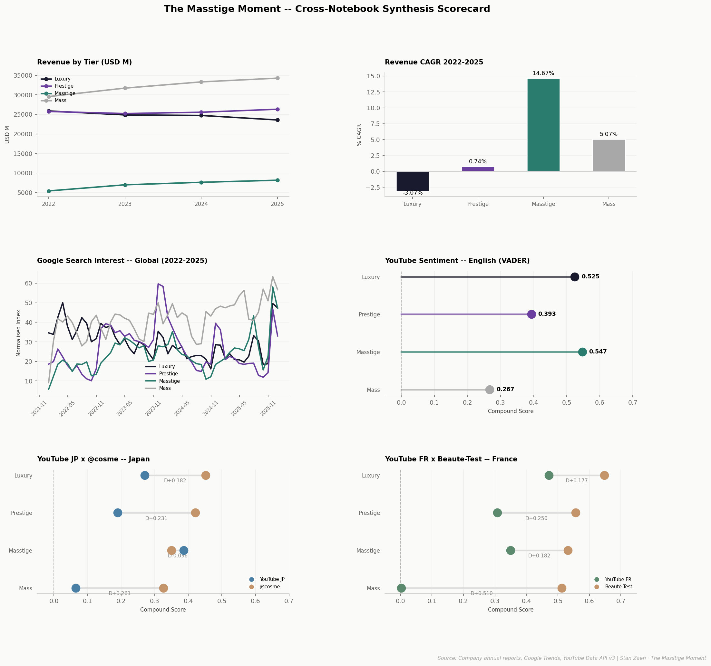
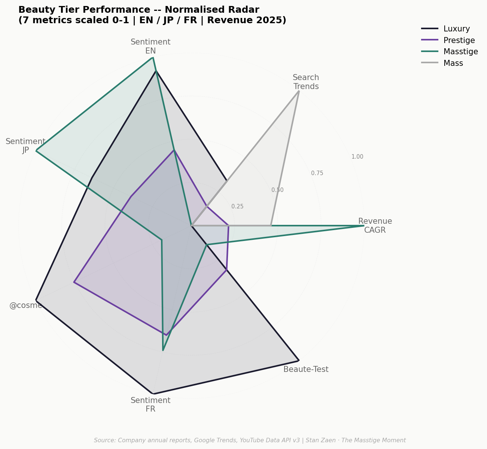

# The Masstige Moment — マスティージの時代

**どの美容ティアがポストコロナ時代を制するのか？**  
Which beauty tier is winning in a post-COVID world?

7つの独立したシグナル（収益成長・検索行動・3言語市場のセンチメント）が同じ結論を指している。  
Seven independent signals — revenue, search, and consumer sentiment across EN / JP / FR — converge on the same answer.

---

## 仮説 / Hypothesis

> マスティージ美容は2022年以降、ラグジュアリーとマス双方を凌駕している。  
> プレミアムな品質を手の届く価格で求める、より目の肥えた消費者に支えられて。

> Masstige beauty has outperformed both luxury and mass segments since 2022,  
> driven by a discerning, aspirational consumer who demands premium quality at accessible price points.

---

## 検証結果：確認 ✓ / Verdict: Confirmed ✓

**「検索せずに買う消費者」** — マスティージの発見経路はサーチエンジンではなく、  
皮膚科医の推薦、口コミ、そしてチャネルへの信頼だ。

The Masstige consumer is **low-browse, high-convert.** Discovery happens through dermatologists,  
communities, and word-of-mouth — not search engines. This is not a weakness; it is a channel signature.

*Nuance:* Established review platforms (@cosme, Beauté-Test) still rank Masstige behind Luxury and Prestige  
— reflecting a category hierarchy that video sentiment is beginning to erode. **The shift is underway, not complete.**

---

## 主要な発見 / Key Findings

| Metric | Luxury | Prestige | **Masstige** | Mass |
|--------|--------|----------|--------------|----- |
| Revenue CAGR 2022–25 | −3.07% | 0.74% | **14.67%** | 5.07% |
| Google Trends Index | 30 | 26 | **24** | 42 |
| YouTube Sentiment (EN) | 0.525 | 0.393 | **0.547** | 0.267 |
| YouTube Sentiment (JP) | 0.270 | 0.190 | **0.386** | 0.065 |
| @cosme Rating | 0.462 | 0.417 | 0.367 | 0.326 |
| YouTube Sentiment (FR) | 0.471 | 0.307 | 0.349 | 0.003 |
| Beauté-Test Rating | 0.648 | 0.557 | 0.532 | 0.512 |

マスティージは収益CAGRで**1位**、YouTube EN・JPで**1位**。7指標中5指標でトップ2圏内。  
Masstige ranks #1 on Revenue CAGR and EN/JP YouTube sentiment. Top 2 in 5 of 7 dimensions.

---

### 見落とされがちな3つの発見 / Three Non-Obvious Insights

**１．検索量の少なさは弱点ではない**  
マスティージのGoogleトレンド指数（24）はマス（42）やラグジュアリー（30）を下回る。  
にもかかわらず、収益成長率はマスの2.9倍だ。消費者は「検索して発見する」のではなく、  
「すでに知っていて買いに来る」。チャネルの信頼が購買を動かしている。

**Low search is not low demand.** Masstige's Trends index (24) trails Mass (42) — yet delivers  
2.9× Mass revenue growth. The consumer already knows what to buy before opening a browser.

---

**２．日本市場：クロスソース検証の最高点**  
YouTube JP（0.386）と@cosme（0.367）のマスティージ・センチメントの差はΔ0.019。  
感情反応（動画コメント）と購買動機型レビュー（@cosme）という、  
方法論的に独立した2つのソースがほぼ同一の結論に達した。  
本プロジェクト全体で最も強力なクロスソース検証結果である。

**Japan: the strongest validation in the project.** YouTube JP and @cosme — two methodologically  
independent sources measuring different phenomena — converge on Masstige sentiment with Δ0.019.

---

**３．フランス市場：価格ではなく、使途とチャネルで分断**  
マスはGoogle検索指数でラグジュアリーの17倍のボリュームを持ちながら、  
YouTubeではlike加重後のスコアが0.003まで崩壊する。  
フランス人消費者は「手頃なブランドへの失望を公言し、それでも買い続ける」。  
美容市場のティア区分は価格帯ではなく、用途・チャネル・購買タイミングによって規定される。

**France: segmented by canal, not price.** Mass dominates search (17× Luxury) but collapses  
on weighted YouTube sentiment (0.003). French consumers publicly voice disappointment —  
then quietly restock. The pharmacie channel (La Roche-Posay, Vichy, Nuxe) delivers satisfaction  
that rivals brands twice the price. **No tier dominates all three signals simultaneously.**

---

**＋ プレステージが真の敗者**  
CAGR 0.74%。プレミアムなポジショニングにもかかわらず、  
下からのマスティージと上からのラグジュアリーに挟まれ、存在感を失いつつある。

**Prestige is the real underperformer.** 0.74% CAGR despite premium positioning —  
squeezed between a resurgent Masstige from below and resilient Luxury from above.

---

## 分析結果サマリー / Synthesis

<p align="center">
  
</p>

<p align="center">
  
</p>

---

## プロジェクト構造 / Project Structure

```
Masstige_Moment/
├── notebooks/
│   ├── 01_market_overview.ipynb          # 収益分析 — 9社の有価証券報告書
│   ├── 02_financial_performance.ipynb    # 株価パフォーマンス — yfinance（方向性参考）
│   ├── 03_google_trends.ipynb            # 検索需要 — pytrends, 8市場
│   ├── 04A_youtube_sentiment.ipynb       # ENセンチメント — YouTube + VADER
│   ├── 04B_コスメ_youtube_センチメント.ipynb  # JPセンチメント — YouTube + GiNZA + @cosme
│   ├── 04C_marché_français_analyse.ipynb # FRセンチメント — YouTube + Beauté-Test (3シグナル)
│   └── 05_finalreport.ipynb              # クロスソース統合・レーダーチャート・エグゼクティブサマリー
├── src/
│   ├── helpers.py                        # 共有ユーティリティ・チャートスタイル・ティアカラー
│   └── helpers_fr.py                     # フランス市場設定（04C専用）
├── data/
│   ├── raw/                              # 各社PDFレポート
│   └── processed/                        # キャッシュ済みpkl・CSV・チャート出力
└── outputs/
    └── charts/                           # 全チャートの最終出力先
```

---

## データソース / Data Sources

| Dimension | Source | Method | Coverage |
|-----------|--------|--------|----------|
| Revenue by tier | L'Oréal, LVMH, Shiseido, Kao, ELC, Kosé, Unilever — annual reports | HTML scraping + pdfplumber | 2022–2025 |
| Stock performance | Yahoo Finance | yfinance API | 2022–2025 |
| Search trends | Google Trends | pytrends · 8 markets · geo-anchored | 2022–2025 |
| Sentiment (EN) | YouTube comments | YouTube Data API v3 + VADER | ~7,000 comments |
| Sentiment (JP) | YouTube + @cosme | YouTube API + GiNZA/Sudachi + star ratings | ~22,000 comments · 2,452 reviews |
| Sentiment (FR) | YouTube + Beauté-Test | YouTube API + DistilCamemBERT + star ratings | ~4,000 comments · 16 brands |

---

## 分析手法 / Methodology Notes

**ティア分類 / Tier classification:**

| Tier | 企業・セグメント / Companies & Segments |
|------|----------------------------------------|
| Luxury | LVMH Perfumes & Cosmetics, Estée Lauder |
| Prestige | L'Oréal Luxe, Shiseido, Kosé |
| Masstige | L'Oréal Dermatological Beauty |
| Mass | L'Oréal Consumer Products, Unilever Beauty & Wellbeing, Kao Cosmetics |

**センチメントスコアリング / Sentiment scoring:**
- EN YouTube: VADER compound score (−1 to +1), like-weighted
- JP YouTube: GiNZA/Sudachi tokenisation + emoji/keyword pattern scoring, like-weighted
- FR YouTube: DistilCamemBERT (1–5 stars → −1 to +1 conversion), like-weighted
- @cosme: 7-point rating → compound via `(rating − 4) / 3`
- Beauté-Test: 5-point star rating → compound via `(stars − 3) / 2`, product-count weighted

**Google Trends アンカー補正 / Anchor correction:**  
各市場の検索行動を正規化するため、地域固有のアンカーワードを使用（JP: スキンケア / FR: soin visage / EN: skincare）。  
市場横断比較の前に各地域を0–100に正規化。英語アンカーのみを使用した初期バージョンでは、  
日仏市場のスコアが過大評価されていた（修正済み）。

Each market uses a geo-specific anchor term before normalising to 0–100. Earlier runs using  
a single English anchor overstated FR and JP scores — corrected in the published analysis.

**株価データの注意点 / Stock data caveat:**  
LVMH（ファッション・レザー約50%）、Unilever（美容約20%）、Kao（化粧品約15%）は  
美容事業のみを反映しない。方向性の参考として保持（NB02）。

LVMH, Unilever, and Kao tickers reflect whole-group performance. Retained for directional  
investor sentiment only — not used as primary evidence for the tier thesis.

---

## ツール / Tools & Libraries

```
pandas · matplotlib · numpy · yfinance · pytrends
vaderSentiment · spacy · ginza · sudachipy · transformers (DistilCamemBERT)
requests · BeautifulSoup · pdfplumber · python-dotenv
```

---

## 実行方法 / Running the Notebooks

各ノートブックは独立して実行可能。データは `data/processed/` にキャッシュ済み。  
`USE_CACHE = False` に設定しない限り、再実行時にAPIは呼び出されない。

Each notebook runs independently. All data cached in `data/processed/`.  
No API calls on subsequent runs unless `USE_CACHE = False`.

```bash
conda activate luxury-analysis
jupyter notebook
```

01 → 05 の順に実行。NB03はpytrends rate limit対策として、フルリラン時に約1時間の待機推奨。  
Run notebooks in order 01 → 05. NB03 requires ~1 hour between full re-runs (pytrends rate limit).

---

## 対象読者 / Target Audience

| 対象 | 目的 |
|------|------|
| **ブランド戦略チーム**（花王・資生堂・ロレアル ジャパン） | ティア別・市場別の消費者インテリジェンス |
| **投資・BD機能**（LVMH・ロレアル） | 収益成長シグナルとポートフォリオへの示唆 |
| **コンサルティング・分析職の採用担当** | エンドツーエンドのプロジェクト構造・多ソース三角検証・仮説駆動型ナラティブ |

| Audience | Purpose |
|----------|---------|
| **Brand strategy teams** (Kao, Shiseido, L'Oréal Japan) | Actionable tier and market intelligence |
| **Investor / BD functions** (LVMH, L'Oréal) | Revenue growth signals and portfolio implications |
| **Analytics & consulting recruiters** | End-to-end project structure, multi-source triangulation, hypothesis-driven narrative |

---

## データ倫理 / Data Ethics

使用した全データソースは公開情報。YouTubeコメントおよびレビューデータは集計センチメント分析のみに使用。  
個人識別情報・ユーザープロファイルの保存・再配布は行っていない。

All data sources used are publicly available. Comments and reviews analysed in aggregate for  
sentiment trends only. No personal identifiers or user profiles stored or redistributed.

---


---

*Analysis by Stanley S · [LinkedIn](https://www.linkedin.com/in/stanley-shi-7b604b104/) · 2026*
