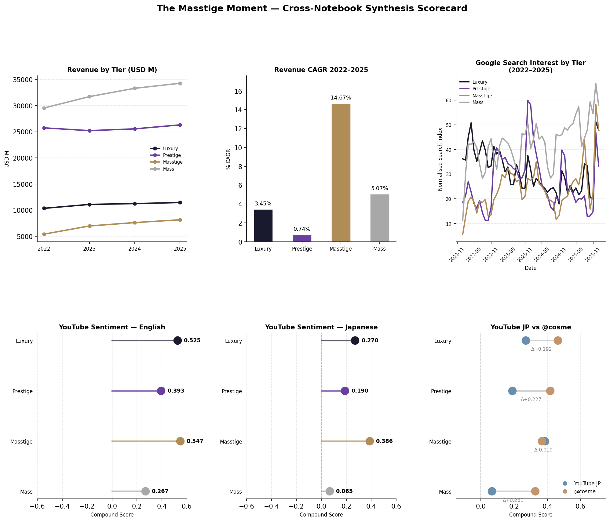
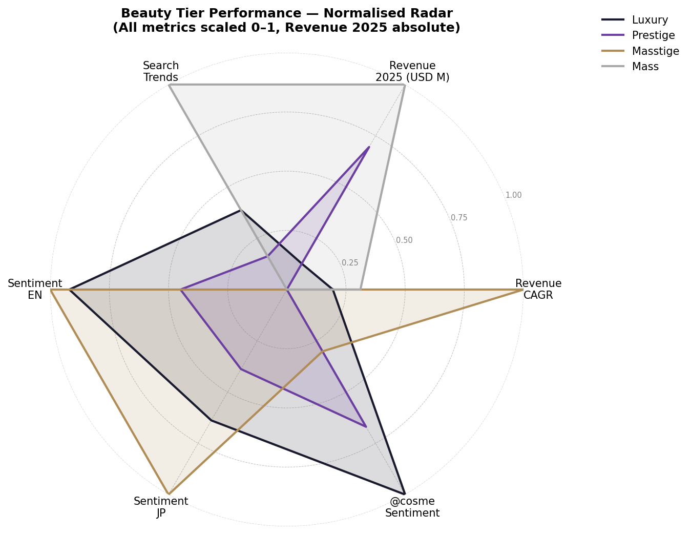

# A Masstige Analysis - a growing market?

## Overview
This project analyses competitive dynamics across luxury, masstige, and mass beauty 
segments from 2022 to present, testing the hypothesis that masstige is outperforming 
both ends of the market as the world emerges from its post-COVID slump.

Built as part of a personal data analytics portfolio to demonstrate applied Python, 
data wrangling, and business analysis skills.

---

## Hypothesis
> Masstige beauty is outperforming both luxury and mass segments (2022–present), 
> driven by a more discerning, aspirational consumer who enjoys premium products
> at accessible pricing.

## Verdict: Confirmed ✓

> **Masstige beauty outperforms all tiers on revenue growth (CAGR 14.67%) and leads or ranks #2 across every sentiment dimension — across English and Japanese markets, across YouTube and purchase-intent review platforms.**
---

### Overall

<p align="center">
  
</p>

<p align="center">
  
</p>

## Key Findings

| Metric | Luxury | Prestige | **Masstige** | Mass |
|--------|--------|----------|--------------|------|
| Revenue CAGR 2022–25 | 3.45% | 0.74% | **14.67%** | 5.07% |
| Google Trends Index | 167 | 60 | **58** | 176 |
| YouTube Sentiment (EN) | 0.525 | 0.393 | **0.547** | 0.267 |
| YouTube Sentiment (JP) | 0.270 | 0.190 | **0.386** | 0.065 |
| @cosme Star Rating | 0.462 | 0.417 | 0.367 | 0.326 |

**Masstige ranks #1 on Revenue CAGR and English sentiment. No other tier ranks above #2 consistently across all five dimensions.**

Three non-obvious insights:
- **Low search volume is not a weakness.** Masstige's Google Trends index (58) trails Luxury (167) and Mass (176) — yet delivers 3x Mass revenue growth. Masstige consumers are low-browse, high-convert. Discovery happens via dermatologists, communities, and word of mouth — not search engines.
- **Japan is the most important masstige market to watch.** The only market where Prestige rivals Mass in search volume, and where @cosme review sentiment for masstige brands converges almost exactly with YouTube JP data (Δ0.019) — the strongest cross-source validation in the project.
- **Prestige is the real underperformer.** 0.74% CAGR despite premium positioning — squeezed between a resurgent masstige from below and resilient luxury from above.

---

## Data Sources

| Dimension | Source | Method | Coverage |
|-----------|--------|--------|----------|
| Revenue by tier | Annual reports — L'Oréal, LVMH, Shiseido, Kao, ELC, Kosé, Unilever | HTML scraping + pdfplumber | 2022–2025 |
| Stock performance | Yahoo Finance | yfinance API | 2022–2024 |
| Search trends | Google Trends | pytrends, 8 markets | 2022–2025 |
| Consumer sentiment (EN) | YouTube comments | YouTube Data API v3 + VADER | ~1,900 comments |
| Consumer sentiment (JP) | YouTube comments | YouTube Data API v3 + GiNZA/Sudachi | ~19,000 comments |
| Purchase sentiment (JP) | @cosme reviews | Web scraping + star rating conversion | 2,452 reviews, 34 brands |

---


## Project Structure

```
Luxury_DataAnalysis/
├── notebooks/
│   ├── 01_market_overview.ipynb                 # Revenue by tier — audited annual reports
│   ├── 02_financial_performance.ipynb           # Stock performance — yfinance (directional)
│   ├── 03_google_trends.ipynb                   # Search demand — pytrends, 8 global markets
│   ├── 04A_youtube_sentiment_en.ipynb           # English sentiment — YouTube + VADER
│   ├── 04B_@コスメ_youtube_センチメント.ipynb     # Japanese sentiment — YouTube + GiNZA + @cosme
│   └── 05_finalreport.ipynb                     # Cross-source synthesis, radar chart, exec summary
├── data/
│   └── processed/                        # All outputs, cached pkl files, charts
└── src/
    └── helpers.py                        # Shared utilities, chart styling, tier colours
```

---

## Key Questions Answered
1. Which beauty tier has grown fastest since 2022? - Masstige
2. Do stock markets reflect the same tier preferences as consumers? - No
3. Are search trends and social sentiment aligned with revenue data? - Weak~medium correlation
4. Which tier has the most favourable consumer sentiment - Geographically-driven, but largely Masstige

---

## Data Sources

| Dimension | Source | Method | Coverage |
|-----------|--------|--------|----------|
| Revenue by tier | Annual reports — L'Oréal, LVMH, Shiseido, Kao, ELC, Kosé, Unilever | HTML scraping + pdfplumber | 2022–2025 |
| Stock performance | Yahoo Finance | yfinance API | 2022–2024 |
| Search trends | Google Trends | pytrends, 8 markets | 2022–2025 |
| Consumer sentiment (EN) | YouTube comments | YouTube Data API v3 + VADER | ~1,900 comments |
| Consumer sentiment (JP) | YouTube comments | YouTube Data API v3 + GiNZA/Sudachi | ~19,000 comments |
| Purchase sentiment (JP) | @cosme reviews | Web scraping + star rating conversion | 2,452 reviews, 34 brands |

---

## Methodology Notes

**Tier classification:**

| Tier | Companies / Segments |
|------|---------------------|
| Luxury | LVMH Perfumes & Cosmetics, Estée Lauder |
| Prestige | L'Oréal Luxe, Shiseido, Kosé |
| Masstige | L'Oréal Dermatological Beauty |
| Mass | L'Oréal Consumer Products, Unilever Beauty & Wellbeing, Kao Cosmetics |

**Stock data caveat:** Public company tickers reflect whole-group performance, not beauty segment performance. LVMH (Fashion & Leather ~50% revenue), Unilever (Beauty ~20%), and Kao (Cosmetics ~15%) are heavily diluted proxies. Retained for directional investor sentiment only — not used as primary evidence for tier thesis.

**Sentiment scoring:**
- English YouTube: VADER compound score (-1 to +1), upvote-weighted
- Japanese YouTube: GiNZA/Sudachi tokenisation + emoji/keyword pattern scoring
- @cosme: 7-point star rating converted to compound scale via `(rating - 4) / 3`

**Cross-source validation:** The convergence of YouTube JP (0.386) and @cosme (0.367) sentiment for masstige — two methodologically independent sources with Δ0.019 — is the strongest single piece of evidence in the project. These sources measure different phenomena (emotional reaction vs. purchase-motivated review) yet arrive at near-identical conclusions.

---

## Tools & Libraries

```
pandas · matplotlib · numpy · yfinance · pytrends
vaderSentiment · spacy · ginza · sudachipy
requests · BeautifulSoup · pdfplumber · python-dotenv
```

---

## Running the Notebooks

Each notebook runs independently. All data is cached in `data/processed/` — no API calls are made on subsequent runs unless `USE_CACHE = False` is set explicitly.

**First run (cold start):**
```bash
conda activate luxury-analysis
jupyter notebook
```
Run notebooks in order 01 → 05. NB03 requires a Google Trends rate limit buffer (~1 hour) between full re-runs.

**Subsequent runs:** All notebooks load from cache. Full execution top to bottom in under 2 minutes.

---

## Target Audience

This project is designed to demonstrate analytical capability to:
- **Brand strategy teams** (Kao, Shiseido, L'Oréal Japan) — actionable tier and market intelligence
- **Investor / BD functions** (LVMH, L'Oréal) — revenue growth signals and portfolio implications
- **Consulting and analytics recruiters** — end-to-end project structure, multi-source triangulation, hypothesis-driven narrative

## Data Ethics Note

All data sources used in this project are publicly available. YouTube comments and @cosme reviews were analysed in aggregate for sentiment trends. No personal identifiers or user profiles are stored or redistributed.

---

## Author

---

*Analysis by Stanley Shi · [\[LinkedIn URL\]](https://www.linkedin.com/in/stanley-shi-7b604b104/) · [2026]*
